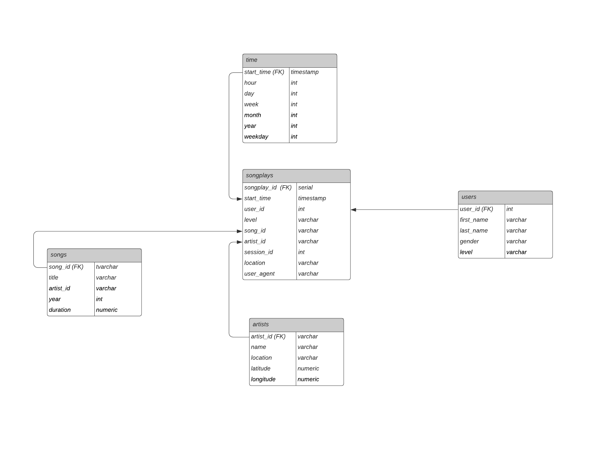
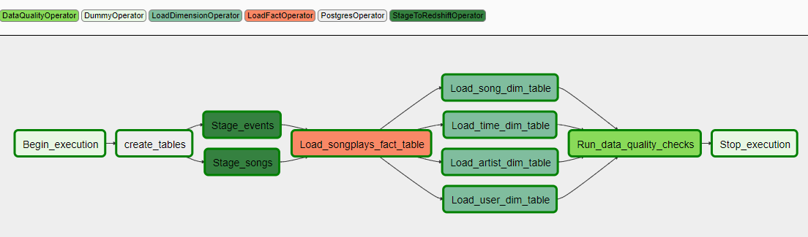
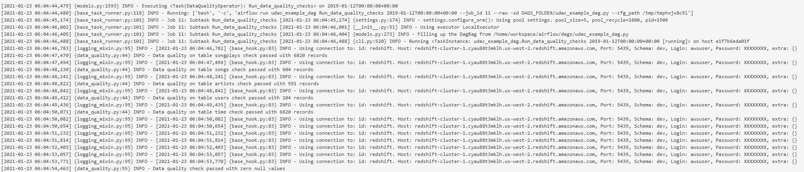

# Data_Pipelines_with_Airflow

> The project helps a music streaming startup Sparkify to introduce more automation and monitoring to their data warehouse ETL pipeline
utilizing Apache Airflow. 

## Table of contents
* [Setup](#setup)
* [Data Warehouse](#data-warehouse)
* [ETL Pipeline](#etl-pipeline)
* [Instructions](#instructions)
* [Example Queries and Results](#example-queries-and-results)

## Setup
* /dags/airflow_pipeline.py to create tables, read, process and load data into the tables and run data quality check
* /dags/create_tables.sql contains queries to create your tables.
* /plugins cotains implementation of operators 

## Data Warehouse
The data warehouse contains two staging tables and a database based on a star schema.

### Staging Tables

**staging_events**: user activity on the app, extracted from JSON logs in S3 bucket 's3://udacity-dend/log_data'
(columns: event_id, artist, auth, firstName, gender, itemInSession, lastName, 
length, level, location, method, page, registration, sessionId, song, status, ts, userAgent, userId)

And below is an example of what the data in a log file, 2018-11-12-events.json, looks like.


**staging_songs**: song information, extracted from JSON metadata in S3 bucket 's3://udacity-dend/song_data'
(columns: num_songs, artist_id, artist_latitude, artist_longitude, artist_location, artist_name, song_id, title, duration, year)

Below is an example of what a single song file, TRAABJL12903CDCF1A.json, looks like.
```
{"num_songs": 1, "artist_id": "ARJIE2Y1187B994AB7", "artist_latitude": null, 
"artist_longitude": null, "artist_location": "", "artist_name": "Line Renaud", "song_id": "SOUPIRU12A6D4FA1E1", 
"title": "Der Kleine Dompfaff", "duration": 152.92036, "year": 0}
```

### Database Schema 

The database is created on a star schema including five tables. 

The fact table is **songplays** - records in log data associated with song plays i.e. records with page NextSong.
**songplays** as the fact table consists of foreign key to four dimension tables: **users**,**songs**,**artists**,**time**.




## ETL Pipeline

The project creates high grade data pipelines that are dynamic and built from reusable tasks, can be monitored, and allow easy backfills.
Data quality checks run after ETL steps to catch any descrepancies in the datasets.

The ETL Pipeline is built to 
+ extract data from a directory of JSON logs on user activity and JSON metadata on the songs store in S3.
+ stages the data in two staging tables in AWS Redshift.
+ transforms staing tables into analytics tables.

The Airflow Dags:



### DAG Configuration

* The DAG runs once an hour at the beginning of the hour.
* The DAG does not have dependencies on past runs.
* On failure, the task are retried 3 times.
* Retries happen every 5 minutes.
* Catchup is turned off.
* It does not email on retry.

## Instructions

### Add Airflow Connections

* Run **/opt/airflow/start.sh** to access the Airflow's UI
* Click on the **Admin** tab and select **Connections**.
* On the create connection page, enter the following values:
  + Conn Id: Enter aws_credentials.
  + Conn Type: Enter Amazon Web Services.
  + Login: Enter your Access key ID from the IAM User credentials.
  + Password: Enter your Secret access key from the IAM User credentials.
* Once you've entered these values, select **Save and Add Another**.
* On the next create connection page, enter the following values:
  + Conn Id: Enter redshift.
  + Conn Type: Enter Postgres.
  + Host: Enter the endpoint of your Redshift cluster, excluding the port at the end. You can find this by selecting your cluster in the Clusters page of the Amazon Redshift console. See where this is located in the screenshot below. **IMPORTANT**: Make sure to NOT include the port at the end of the Redshift endpoint string.
Schema: Enter dev. This is the Redshift database you want to connect to.
  + Login: Enter awsuser.
  + Password: Enter the password you created when launching your Redshift cluster.
  + Port: Enter 5439.

### Run the pipeline
* Refresh the DAG.
* Turn on the DAG.
* Triggered the DAG manually.
* Click into the DAG, go to the **Graph View** tab to monoitor the process.
* Check the **Log** of Run_data_quality_checks to make sure tables are loaded successfully.

The sample result should look like:



## Example Queries and Results
Go to Redshift's **Query editor** to write analytical SQL queries.

Question: Is there subscription percentage difference between male and female users?

Queries:
```
"SELECT gender, 
        COUNT(*) AS gender_count, 
        ROUND(AVG(CASE WHEN level = 'paid' THEN 100 ELSE 0 END),2) AS paid_percentage
FROM (SELECT DISTINCT s.user_id, 
                      gender, 
                      s.level 
      FROM songplays s 
      JOIN users u 
      ON s.user_id = u.user_id) t
GROUP BY 1"
```

Results:
```
gender gender_count paid_percentage
F        60           25.00%
M        44           15.91%
```

**Subscription rate is higher for female in the sample**
